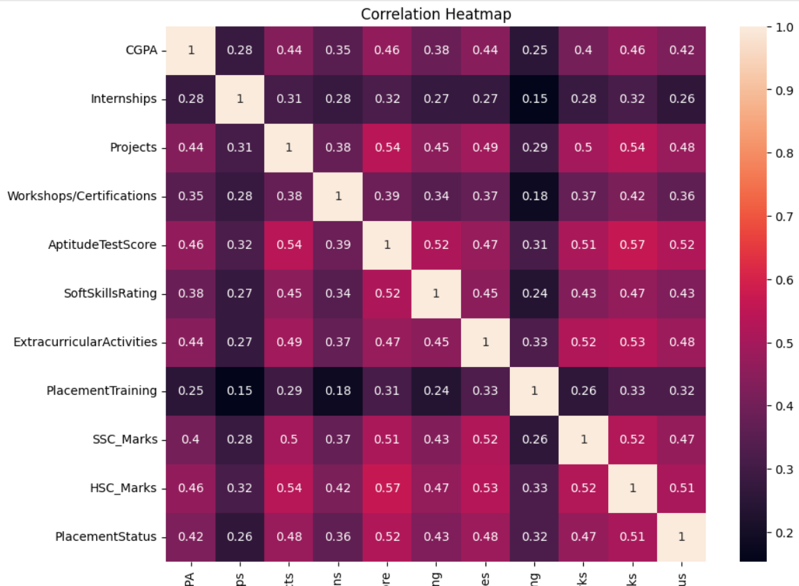
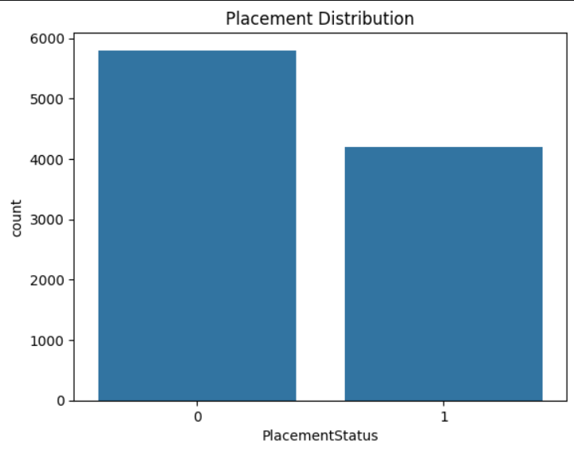
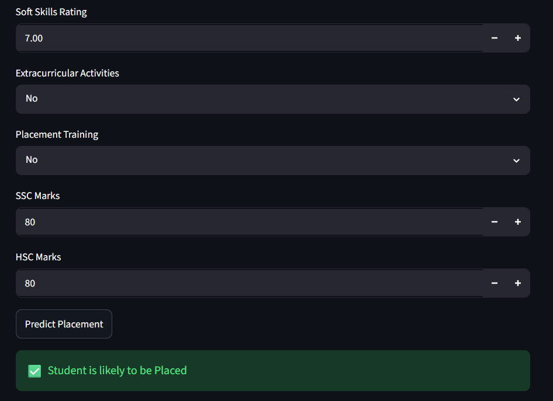

# 🎓 Student Placement Predictor

## 📌 Overview

The Student Placement Predictor is a Machine Learning project that predicts whether a student is likely to be placed based on academic performance, aptitude scores, internships, projects, certifications, soft skills, and other factors.

This project demonstrates the complete Machine Learning workflow, including:

- Data Preprocessing
- Feature Engineering
- Model Training
- Model Evaluation
- Feature Importance Analysis
- Model Deployment using Streamlit

---

## 📊 Dataset Information

Dataset: Synthetic Student Placement Dataset

### Features

- CGPA
- Internships
- Projects
- Workshops/Certifications
- Aptitude Test Score
- Soft Skills Rating
- Extracurricular Activities
- Placement Training
- SSC Marks
- HSC Marks

### Target Variable

- PlacementStatus
  - Placed
  - Not Placed

Dataset Size:

- 10,000 Records
- 10 Input Features

---

## 🛠 Technologies Used

- Python
- Pandas
- NumPy
- Scikit-learn
- Matplotlib
- Seaborn
- Streamlit
- Joblib

---

## 🤖 Machine Learning Models

### Logistic Regression

Accuracy: **79.45%**

### Random Forest Classifier

Accuracy: **78.15%**

---

## 📈 Feature Importance

The most influential features for placement prediction were:

1. HSC Marks
2. Aptitude Test Score
3. SSC Marks
4. CGPA
5. Soft Skills Rating

### Feature Importance Visualization


---

## 🔥 Correlation Heatmap



---

## 📊 Placement Distribution



---

## 🌐 Streamlit Web Application

### Input Form


### Prediction Result



---

## 🚀 How to Run the Project

### Clone the Repository

```bash
git clone <your-repository-url>
cd Student_Placement_Predictor
```

### Install Dependencies

```bash
pip install -r requirements.txt
```

### Run the Streamlit App

```bash
python -m streamlit run app.py
```

---

## 📁 Project Structure

```text
Student_Placement_Predictor/
│
├── data/
│   └── placedata_v2.0_synthetic.csv
│
├── models/
│   └── placement_model.pkl
│
├── notebooks/
│   └── placement_predictor.ipynb
│
├── screenshots/
│   ├── feature_importance.png
│   ├── heat_map.png
│   ├── placement_status.png
│   ├── streamlit_form.png
│   └── prediction.png
│
├── app.py
├── requirements.txt
├── README.md
├── LICENSE
└── .gitattributes
```

---

## 🎯 Future Improvements

- Hyperparameter Tuning
- Cross Validation
- Additional Machine Learning Models
- Public Cloud Deployment
- Improved User Interface
- Real-world Dataset Integration

---

## 👨‍💻 Author

Pruthvi Keshav K

Second-Year Engineering Student

Machine Learning Enthusiast